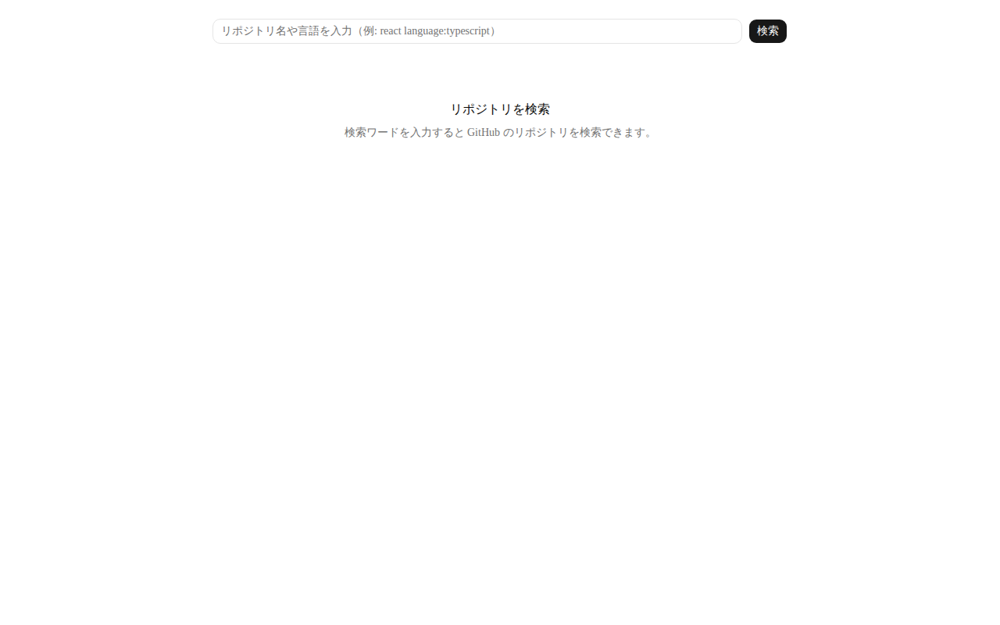
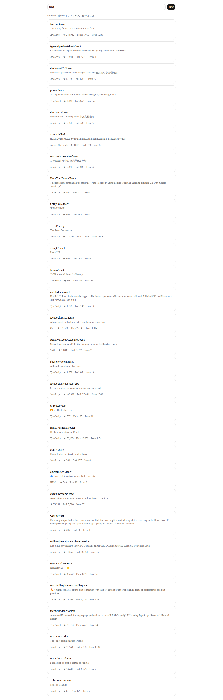
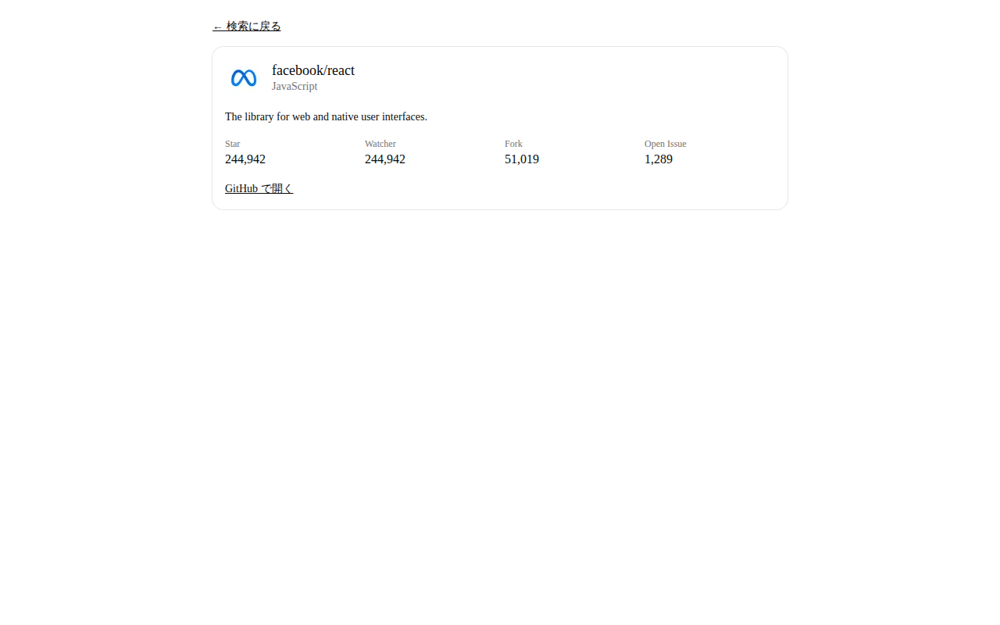
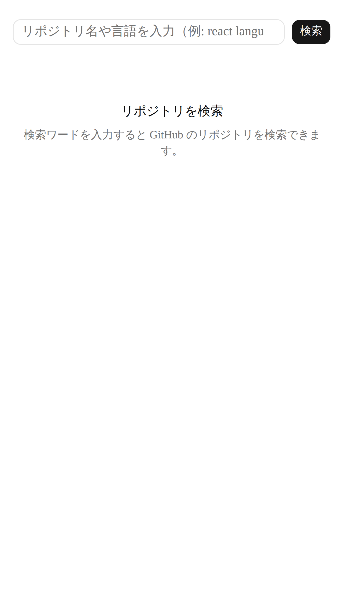

# github-repo-finder

[](https://github.com/akaitigo/github-repo-finder/actions/workflows/ci.yml)


[](LICENSE)

GitHub のリポジトリを検索する Web アプリケーション。Next.js v16 + App Router で実装、軽量レイヤード4層 + Composition Root を採用、infrastructure 層に 14 種類の異常系テストを実装して外部 API 境界の堅牢性を担保。



## Requirements

- Node.js v22+ (`.nvmrc` / `mise.toml` に固定)
- pnpm v10.33.0+ (`packageManager` フィールドで Corepack が自動起動)
- (オプション) GitHub Personal Access Token: 未認証で 10 req/min、認証で 30 req/min

## Quick Start

```bash
git clone git@github.com:akaitigo/github-repo-finder.git
cd github-repo-finder
pnpm install --frozen-lockfile
cp .env.example .env.local   # 必要なら GITHUB_TOKEN を設定
pnpm dev                     # http://localhost:3000
```

## できること

- リポジトリ名 / 言語 / qualifier (`language:typescript`, `stars:>1000`) で GitHub Search API を叩く
- 結果一覧で full_name / 説明 / 言語 / Star / Fork / Open Issue 数を表示
- 1 件クリックで詳細ページ (`/repositories/[owner]/[repo]`) に遷移、avatar + Star / Watcher / Fork / Issue の 4 count を表示
- URL 同期戦略 (`?q=react`) なので **検索結果の URL を共有可能** (deep link)

## アーキテクチャ

```
┌──────────────────────────────────────────────────┐
│  app (Composition Root)                           │
│   container.ts / page.tsx (薄殻) / render-* (純粋関数) │
└─────────────────┬──────────┬──────────────┬───────┘
                  │          │              │
        ┌─────────▼──┐  ┌────▼────────┐  ┌──▼─────────┐
        │ presentation│  │ application │  │infrastructure│
        │ (UI 表示)    │  │ (UseCase +  │  │ (GitHub API)│
        │             │  │ port + map-*)│  │            │
        └──────┬──────┘  └──────┬───────┘  └──────┬─────┘
               │                │                  │
               └────────┬───────┴──────────────────┘
                        ▼
                 ┌──────────────┐
                 │   domain     │
                 │ (純粋ロジック) │
                 │ Result, Repository,│
                 │ SearchQuery, ValidationError│
                 └──────────────┘
```

依存方向は ESLint `no-restricted-imports` で機械強制 ([`eslint.config.mjs`](eslint.config.mjs))。

詳細: [`docs/adr/0001-layered-architecture.md`](docs/adr/0001-layered-architecture.md)

## 設計判断 3 行サマリ

1. **軽量レイヤード4層 + Composition Root** ([ADR 0001](docs/adr/0001-layered-architecture.md))
2. **`Result<T, E>` + discriminated union + `assertNever`** で型レベルにエラー表現 ([ADR 0002](docs/adr/0002-result-type.md))
3. **Server Component 主体 + URL 同期戦略** で deep link / SSR / token 保護を両立 ([ADR 0003](docs/adr/0003-server-component-strategy.md))

### 設計判断の根拠表

| 採用パターン | 実装ファイル | 保守上の価値 |
|------------|------------|------------|
| ESLint `no-restricted-imports` で依存方向を機械強制 | [`eslint.config.mjs`](eslint.config.mjs) | レイヤー違反を CI 前に検出、設計の腐敗を防止 |
| `assertNever` で discriminated union の網羅性をコンパイル時保証 | [`src/lib/assert-never.ts`](src/lib/assert-never.ts) | kind 追加時に switch 漏れがコンパイルエラー |
| 境界変換責務を `_internal/map-*-error.ts` に集約 | [`src/application/use-cases/_internal/`](src/application/use-cases/_internal/) | 「どこで infra → app の変換が起きるか」が一意 |
| zod でレスポンス検証 (schema drift 検知) | [`src/infrastructure/github/github-api-types.ts`](src/infrastructure/github/github-api-types.ts) | GitHub API 仕様変更を CI で検知、`malformed-response{cause:'schema'}` に倒す |
| 403/429 三分類 (rate-limited / secondary / forbidden) | [`src/infrastructure/github/github-repository-gateway.ts`](src/infrastructure/github/github-repository-gateway.ts) | 「待てば直る」と「ユーザー操作要」を UI で区別、誤誘導防止 |
| `<Link href="?q={q}">` で Retry (callback なし) | [`src/presentation/components/rate-limit-display.tsx`](src/presentation/components/rate-limit-display.tsx) | URL 共有可能性を維持、deep link で同じ画面に再到達可能 |
| page.tsx 薄殻 + `render-*` helper 抽出 | [`src/app/_lib/render-search-result.tsx`](src/app/_lib/render-search-result.tsx) | Vitest が async Server Component 非対応のため、純粋関数化してテスト可能に |

## 「制約と判断」表

| やったこと | 意図的にやらなかったこと（理由） | 時間があれば追加したいこと |
|----------|------------------------------|------------------------|
| Server Component 主体 (Client は SearchForm + RateLimit + Error の 3 つのみ) | E2E で rate-limit モック (結合テストでカバー済み、E2E は SSR 動作証明だけに絞る) | (1) Sentry 統合 / 構造化ログ |
| infrastructure 層に 14+ 異常系テスト (rate-limit 3 分類 / 5xx / JSON 破損 / schema drift / null / URL エンコード) | フル DDD (集約ルート / Repository / DomainService、課題規模に対して overkill) | (2) ISR キャッシュ / 実 API スモークテスト |
| rate-limit UX (Search bucket = 10 req/min 未認証 を理解した上で 3 分類して誘導) | Server Action (検索は read-only + URL 共有可能性が本質、ADR 0003 で詳細) | (3) axe + Lighthouse の CI 統合 |
| ESLint レイヤー強制 + `assertNever` 網羅性保証 + zod schema drift 検知 | 全コンポーネント包括テスト (重要部品 = 結合テスト + a11y 違反 0 検証に絞る) | (4) ダークモード / PPR / Suspense streaming |

## テスト戦略

| 層 | 数 | 速度 | 担保範囲 |
|----|----|------|---------|
| **unit** (vitest, node) | 200+ | 高速 | ロジック・型・境界変換 |
| **integration** (vitest + jsdom + axe) | 30+ | 中速 | コンポーネント結合 + a11y + XSS 防御 |
| **E2E** (Playwright, chromium) | 2 | 低速 | SSR 描画 + URL 同期の動作証明 (CI 除外、ローカル実行) |

### カバレッジ閾値 (per-layer、CI で機械検証)

| 層 | CI 必須 | 現状 |
|----|--------|------|
| domain | 90% | -- (型のみ、ランタイム実行ゼロ) |
| application | 80% | 84.6% (Stmts) |
| infrastructure | 75% | 97.4% (Stmts) / 100% (Funcs) |
| presentation | 60% | 96.2% (Stmts) |
| app/_lib | 90% | 93.1% (Stmts) |

設定: [`vitest.config.ts`](vitest.config.ts)

## スクリーンショット

| | |
|---|---|
| トップ |  |
| 検索結果 |  |
| 詳細 |  |
| モバイル (iPhone 14 Pro Max emulation) |  |

## AI 活用レポート

> **AI 生成物の採否判断と責任は私が持つ**

### 活用方針

| 任せた領域 | 任せなかった領域 |
|----------|--------------|
| ボイラープレート (config, package.json scripts), テストコード骨格, ドキュメント下書き, 型定義の書き起こし | 設計判断 (4 層採用), エラーハンドリング規約 (Result + 境界変換責務), Server / Client 境界, UI マッピング表 |

### 判断基準

- **採用**: 設計判断と一致 + テスト pass + 自分が説明可能
- **修正**: 動くが「なぜ動くか」を自分が言語化できない箇所は書き換え
- **却下**: token 漏洩リスク / 設計思想と矛盾 / 説明できない

### 却下した 1 件 (before / after)

**AI 提案 (却下)**: Client Component 内で `useEffect` + `fetch('/api/search?q=...')` パターン

```typescript
// ❌ Before (AI 提案、却下)
'use client';
export function SearchPage({ q }: { q: string }) {
  const [data, setData] = useState(null);
  useEffect(() => {
    fetch(`/api/search?q=${q}`).then(r => r.json()).then(setData);
  }, [q]);
  return data ? <RepositoryList items={data.items} /> : <Loading />;
}
```

**却下理由 (3 軸)**:
1. **token 漏洩**: `GITHUB_TOKEN` を public env に出すか server proxy が必要 → 構成複雑化
2. **deep link 喪失**: `useState` で q 保持すると URL に反映されず、検索結果 URL を共有できない
3. **SSR 初期表示劣化**: クライアント fetch まで empty 画面、LCP / CLS 悪化

```typescript
// ✅ After (採用): Server Component で fetch、URL 同期
export default async function Home({ searchParams }: PageProps<'/'>) {
  const q = normalizeSearchParam((await searchParams).q);
  if (q === undefined) return <EmptyState reason="initial" />;
  const result = await createSearchUseCase().execute(q);
  return renderSearchResult({ result, q });
}
```

詳細: [ADR 0003 「却下した 1 件の事例」](docs/adr/0003-server-component-strategy.md)

## 学習過程

- **Next.js v15+ の async Server Component 仕様変更** を一次情報 (公式 RFC + docs) で確認した上で、`searchParams: Promise<...>` の await + `normalizeSearchParam` seam 設計を確定。事前知識を当てはめるのではなく、現行仕様に即した設計に書き直した。
- **Vitest が async Server Component を公式非対応**である事実に気付いた段階で、page.tsx 薄殻 + `render-*` helper 抽出に方針転換。型定義とテスト容易性を両立する解にたどり着いた。

## 今後の拡張案

| カテゴリ | 候補 |
|---------|------|
| 運用 | Sentry / Vercel Analytics / Web Vitals 計測 / CSP 強化 (`'unsafe-inline'` 除去) / 構造化ログ |
| データ層 | ISR を使った検索結果キャッシュ / 実 GitHub API スモークテスト (schema drift の自動検知) |
| UX | Server Actions (お気に入り保存) / Suspense streaming / Parallel Routes (詳細モーダル) / ダークモード / PPR |

## ディレクトリ構造

```
src/
├── domain/              # 純粋ロジック・値オブジェクト・型
│   ├── shared/result.ts
│   ├── repository/repository.ts
│   └── search/{search-query.ts, validation-error.ts}
├── application/         # UseCase + 境界変換 + port
│   ├── use-cases/
│   │   ├── search-repositories.ts
│   │   ├── get-repository-detail.ts
│   │   └── _internal/{map-gateway-error, map-validation-error}.ts
│   ├── ports/{repository-gateway, gateway-error}.ts
│   ├── errors/application-error.ts
│   └── types/search-result.ts
├── infrastructure/      # 外部 IO (GitHub API)
│   └── github/{github-api-types, github-api-mapper, github-repository-gateway}.ts
├── presentation/        # UI コンポーネント
│   └── components/{repository-card, repository-list, repository-detail, search-form, ...}.tsx
├── app/                 # Composition Root + Next.js App Router
│   ├── _lib/{container, normalize-search-params, render-search-result, render-detail}.{ts,tsx}
│   ├── page.tsx (薄殻)
│   ├── repositories/[owner]/[repo]/page.tsx (薄殻)
│   ├── {layout, loading, error, not-found}.tsx
│   └── globals.css
├── components/ui/       # shadcn/ui 生成物 (button, input, card, skeleton, alert)
└── lib/                 # ユーティリティ (assert-never, utils)
tests/
├── helpers/{msw, factories, test-doubles}/
├── fixtures/github-api/  # GitHub API レスポンス JSON 7 本
├── integration/app/     # render-* helper / error-boundary 結合テスト
└── e2e/                 # Playwright (CI 除外、ローカル実行)
docs/
├── adr/0001-0003.md     # アーキテクチャ判断記録
├── issues/              # Issue 雛形 (#1-#11)
├── reference/           # 公式ドキュメント抜粋集
├── screenshots/         # PC / mobile スクリーンショット
└── README-sync-rule.md  # README と詳細ドキュメントの整合性ルール
```

## CI

GitHub Actions (`.github/workflows/ci.yml`) で以下を機械検証:
- `pnpm lint` (ESLint flat config + レイヤー依存ルール + `dangerouslySetInnerHTML` 禁止)
- `pnpm build` (PageProps 型生成のため typecheck より先)
- `pnpm typecheck` (TypeScript strict)
- `pnpm test:coverage` (vitest + per-layer thresholds)

E2E (Playwright) は CI から除外、ローカル `pnpm test:e2e` で実行 (理由: flaky リスク + ブラウザ install で CI 時間圧迫)。

## PR タイトル / ブランチ命名規約

- PR タイトル: `feat: #N <短文>` または `fix: #N <短文>` または `chore: #N <短文>`
- ブランチ: `feat/<番号>-<短名>` (例: `feat/6-infrastructure`)
- マージ: `squash merge` のみ、main は必ず CI green

## License

[MIT](LICENSE)

## Author

[@akaitigo](https://github.com/akaitigo)

## Acknowledgments

- [Next.js](https://nextjs.org/) / [Vercel](https://vercel.com/)
- [shadcn/ui](https://ui.shadcn.com/) (base-nova preset, Base UI)
- [Tailwind CSS v4](https://tailwindcss.com/)
- [zod](https://zod.dev/)
- [Vitest](https://vitest.dev/) / [Playwright](https://playwright.dev/) / [vitest-axe](https://github.com/chaance/vitest-axe)
- [GitHub REST API](https://docs.github.com/en/rest)
