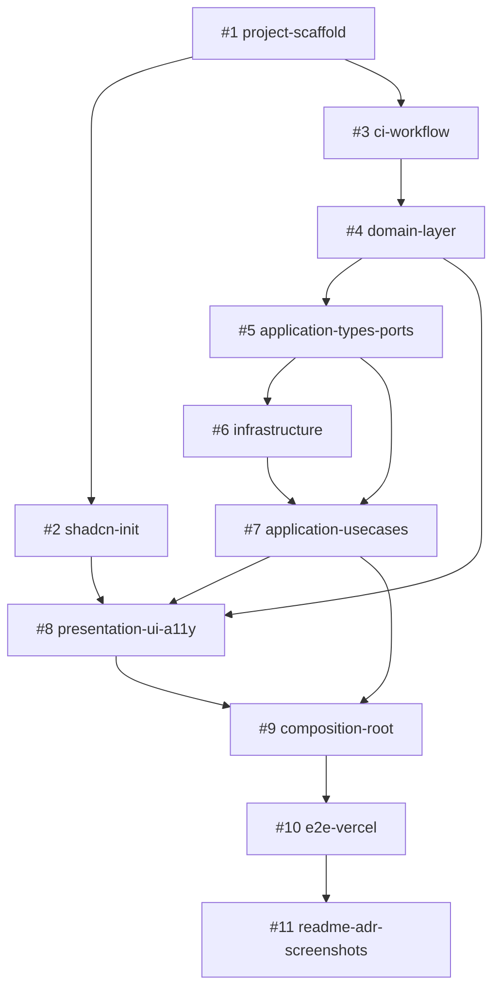

# Issue 雛形（11件）

このディレクトリは GitHub に登録する前の Issue 本文の雛形。`gh issue create --body-file docs/issues/01-project-scaffold.md --title "..."` で一括登録可能。

> **設計判断のポイント**:
> - #8 ↔ #9 順序: presentation を先、composition root を後（placeholder 手戻り防止）
> - 旧統合 PR を #10 (E2E+Vercel) と #11 (README+ADR+スクショ) に分割
> - 各 Issue に「設計意図1行」「最初の1ファイル」「明示却下事項」「CI担保範囲定性記述」を含む統一構造
> - ローカル作業手順は `.gitignore` 対象のローカルメモで管理

## Issue 依存図（Mermaid）



## 推奨実装順序

```
#1 → #2 (#1直下、#3と並行可)
   → #3 → #4 → #5 → #6 → #7 → #8 → #9 → #10 → #11
```

注: `#2` と `#3` は依存関係上は並行可能だが、実装スケジュール上は**直列で進める方が初学者向け**。

## ファイル一覧

| # | ファイル | タイトル | ラベル | 主担当層 |
|---|---------|---------|--------|----------|
| 1 | [01-project-scaffold.md](01-project-scaffold.md) | Next.js v16 プロジェクト初期化 | `type:setup` | tooling |
| 2 | [02-shadcn-init.md](02-shadcn-init.md) | shadcn/ui 初期化 | `type:setup` | tooling |
| 3 | [03-ci-workflow.md](03-ci-workflow.md) | GitHub Actions CI + vitest.config.ts | `type:ci` | tooling |
| 4 | [04-domain-layer.md](04-domain-layer.md) | domain層 + 全ユニットテスト | `type:feat`, `layer:domain` | domain |
| 5 | [05-application-types-ports.md](05-application-types-ports.md) | application/ports + types | `type:feat`, `layer:app-types` | application |
| 6 | [06-infrastructure.md](06-infrastructure.md) | infrastructure (GitHub APIクライアント) + 14異常系テスト | `type:feat`, `layer:infra` | infrastructure |
| 7 | [07-application-usecases.md](07-application-usecases.md) | application層 (UseCase + map-* 変換) | `type:feat`, `layer:app` | application |
| 8 | [08-presentation-ui-a11y.md](08-presentation-ui-a11y.md) | presentation (UIコンポーネント) + a11y + 結合テスト | `type:feat`, `layer:ui` | presentation |
| 9 | [09-composition-root.md](09-composition-root.md) | app/ Composition Root + render-* helper + page.tsx 薄殻 | `type:feat`, `layer:app-root` | app |
| 10 | [10-e2e-vercel.md](10-e2e-vercel.md) | E2E (Playwright) + Vercel デプロイ | `type:feat`, `type:ci` | delivery |
| 11 | [11-readme-adr-screenshots.md](11-readme-adr-screenshots.md) | README + ADR 3本 + 品質証跡スクショ | `type:docs` | docs |

## 各 Issue 雛形の構成

すべての Issue は以下の統一構造:

```markdown
# Issue #N: <タイトル>

> **設計意図**: 1行で「なぜこの PR が必要か / なぜ今このタイミングか」（PR一覧 preview で見える）

## 目的
このPRで何を達成するか、なぜ必要か

## 完了条件
- [ ] チェックボックス形式の完了基準

## 非スコープ
このPRでは扱わないこと（後続Issueに委譲）

### 明示却下事項（積極的にやらない）
やらない判断とその理由（設計判断の明示）

## 依存Issue
- 先行: #...
- 後続: #...

## 関連 reference
- `reference/...`

## ラベル
- `type:...`, `layer:...`

## ブランチ名
`feat/N-short-name`

## 実装メモ

### 最初の1ファイル
このPRで一番最初に書くべき1ファイル + 理由

### 設計判断
着手時の注意点

## CI 担保範囲（Issue 完了時点）
このPRが merge された時点で CI が**初めて何を機械検証**するか
（読者への段階的品質向上明示）
```

## ラベル定義表

| ラベル | 色 | 意味 |
|--------|-----|------|
| `type:setup` | `0E8A16` (緑) | プロジェクト初期化系 |
| `type:ci` | `1D76DB` (青) | CI/CD パイプライン |
| `type:feat` | `5319E7` (紫) | フィーチャー実装 |
| `type:docs` | `FBCA04` (黄) | ドキュメント |
| `layer:domain` | `BFD4F2` (淡青) | domain 層 |
| `layer:app-types` | `BFDADC` (淡緑) | application/ports & types |
| `layer:app` | `5DC8B4` (緑青) | application/use-cases |
| `layer:app-root` | `C5DEF5` (淡水色) | app/ composition root |
| `layer:infra` | `F9D0C4` (淡橙) | infrastructure |
| `layer:ui` | `F9C13C` (橙) | presentation/components |

## PR タイトル規約

```
feat: #N <短文>     # フィーチャー
chore: #N <短文>    # セットアップ・CI
test: #N <短文>     # テストのみ追加
docs: #N <短文>     # ドキュメント
refactor: #N <短文> # リファクタ
fix: #N <短文>      # バグ修正
```

例:
- `feat: #4 add domain layer with Result type and SearchQuery VO`
- `chore: #1 scaffold Next.js v16 + Tailwind v4 + ESLint flat config`
- `docs: #11 add README, ADR 3 files, and quality screenshots`

## ブランチ命名規則（v3 統一）

**全 Issue で `feat/<番号>-<短名-kebab>` に統一**。type による分岐はラベルで表現し、ブランチ名は番号で識別。

```
feat/<番号>-<短名-kebab>
```

例:
- `feat/1-project-scaffold`
- `feat/4-domain-layer`
- `feat/11-readme-adr-screenshots`

CI ワークフローも `on: push: branches-ignore: [main]` で一括対応（`feat/` プレフィクス縛りなし、ただし運用上は `feat/` 統一）。

## 一括登録コマンド

```bash
# 1. ラベル登録（先行）
gh label create "type:setup" --color "0E8A16" --description "Project initialization"
gh label create "type:ci" --color "1D76DB" --description "CI/CD pipeline"
gh label create "type:feat" --color "5319E7" --description "Feature implementation"
gh label create "type:docs" --color "FBCA04" --description "Documentation"
gh label create "layer:domain" --color "BFD4F2" --description "domain layer"
gh label create "layer:app-types" --color "BFDADC" --description "application/ports & types"
gh label create "layer:app" --color "5DC8B4" --description "application/use-cases"
gh label create "layer:app-root" --color "C5DEF5" --description "app/ composition root"
gh label create "layer:infra" --color "F9D0C4" --description "infrastructure"
gh label create "layer:ui" --color "F9C13C" --description "presentation/components"

# 2. Issue 登録（11件、依存関係はWeb UIで設定）

gh issue create --title "Next.js v16 プロジェクト初期化" \
  --body-file docs/issues/01-project-scaffold.md --label "type:setup"

gh issue create --title "shadcn/ui 初期化" \
  --body-file docs/issues/02-shadcn-init.md --label "type:setup"

gh issue create --title "GitHub Actions CI + vitest.config.ts" \
  --body-file docs/issues/03-ci-workflow.md --label "type:ci"

gh issue create --title "domain層 + 全ユニットテスト" \
  --body-file docs/issues/04-domain-layer.md --label "type:feat,layer:domain"

gh issue create --title "application/ports + types" \
  --body-file docs/issues/05-application-types-ports.md --label "type:feat,layer:app-types"

gh issue create --title "infrastructure (GitHub APIクライアント) + 14異常系テスト" \
  --body-file docs/issues/06-infrastructure.md --label "type:feat,layer:infra"

gh issue create --title "application層 (UseCase + map-* 変換)" \
  --body-file docs/issues/07-application-usecases.md --label "type:feat,layer:app"

gh issue create --title "presentation (UIコンポーネント) + a11y + 結合テスト" \
  --body-file docs/issues/08-presentation-ui-a11y.md --label "type:feat,layer:ui"

gh issue create --title "app/ Composition Root + render-* helper + page.tsx 薄殻" \
  --body-file docs/issues/09-composition-root.md --label "type:feat,layer:app-root"

gh issue create --title "E2E (Playwright) + Vercel デプロイ" \
  --body-file docs/issues/10-e2e-vercel.md --label "type:feat,type:ci"

gh issue create --title "README + ADR 3本 + 品質証跡スクショ" \
  --body-file docs/issues/11-readme-adr-screenshots.md --label "type:docs"
```
